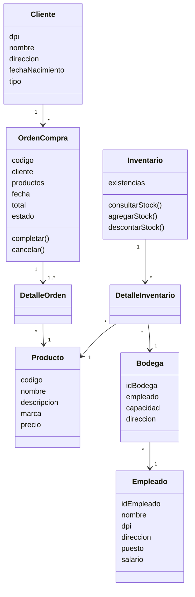

# Diagrama UML

```mermaid
classDiagram
    Cliente "1" --> "*" OrdenCompra
    OrdenCompra "1" --> "1..*" DetalleOrden
    DetalleOrden "*" --> "1" Producto
    Inventario "1" --> "*" DetalleInventario
    DetalleInventario "*" --> "1" Producto
    DetalleInventario "*" --> "1" Bodega
    Bodega "*" --> "1" Empleado
    class Producto {
      codigo
      nombre
      descripcion
      marca
      precio
    }
    class Cliente {
      dpi
      nombre
      direccion
      fechaNacimiento
      tipo
    }
    class OrdenCompra {
      codigo
      cliente
      productos
      fecha
      total
      estado
      completar()
      cancelar()
    }
    class Empleado {
      idEmpleado
      nombre
      dpi
      direccion
      puesto
      salario
    }
    class Bodega {
      idBodega
      empleado
      capacidad
      direccion
    }
    class Inventario {
      existencias
      consultarStock()
      agregarStock()
      descontarStock()
    }
```
